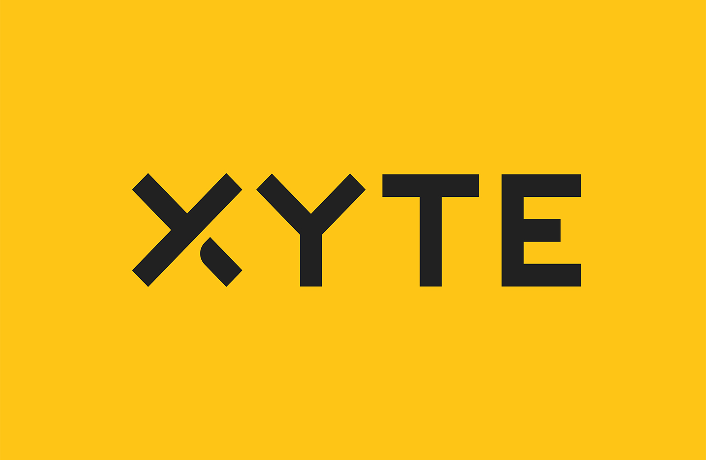

<div align="left">

[](https://xyte.io)

# [Xyte](https://xyte.io)<a id="xyte"></a>

Xyte's Device Cloud is the first all-in-one servitization platform designed for device and hardware manufacturers to cloudify, operate, support, and commercialize their connected devices in a unified platform. 

We enable OEMs across different industries to navigate their digital journey, transforming their devices into integrated business solutions that combine hardware, software and services. The only business and commerce platform designed specifically for IoT device manufacturers, our fully-federated Device Cloud empowers OEMs to manage the complete lifecycle of their devices, from the minute they leave the warehouse through aftermarket sales to end customers.

Our out-of-the-box applications for asset management, remote support, ecommerce and subscription management, financing, and a powerful and secure back office suite help OEMs boost revenue and market growth, optimize operational efficiencies, gain instant insights into equipment and device performance, and develop sustainable customer relationships.

</div>

## Table of Contents<a id="table-of-contents"></a>

<!-- toc -->

- [Installation](#installation)
- [Getting Started](#getting-started)
- [Reference](#reference)
  * [`xyte.device.appendDumpFile`](#xytedeviceappenddumpfile)
  * [`xyte.device.closeIncident`](#xytedevicecloseincident)
  * [`xyte.device.createRegistration`](#xytedevicecreateregistration)
  * [`xyte.device.deleteDevice`](#xytedevicedeletedevice)
  * [`xyte.device.getAllDeviceStateHistories`](#xytedevicegetalldevicestatehistories)
  * [`xyte.device.getChildDevices`](#xytedevicegetchilddevices)
  * [`xyte.device.getCommand`](#xytedevicegetcommand)
  * [`xyte.device.getConfig`](#xytedevicegetconfig)
  * [`xyte.device.getConfig_0`](#xytedevicegetconfig_0)
  * [`xyte.device.getFile`](#xytedevicegetfile)
  * [`xyte.device.getFiles`](#xytedevicegetfiles)
  * [`xyte.device.getIncidents`](#xytedevicegetincidents)
  * [`xyte.device.getInfo`](#xytedevicegetinfo)
  * [`xyte.device.getInfo_0`](#xytedevicegetinfo_0)
  * [`xyte.device.getLicense`](#xytedevicegetlicense)
  * [`xyte.device.getLicenses`](#xytedevicegetlicenses)
  * [`xyte.device.getSpaceInfo`](#xytedevicegetspaceinfo)
  * [`xyte.device.getStateHistory`](#xytedevicegetstatehistory)
  * [`xyte.device.getTelemetries`](#xytedevicegettelemetries)
  * [`xyte.device.listCommands`](#xytedevicelistcommands)
  * [`xyte.device.listDevices`](#xytedevicelistdevices)
  * [`xyte.device.openIncident`](#xytedeviceopenincident)
  * [`xyte.device.registerChildDevice`](#xytedeviceregisterchilddevice)
  * [`xyte.device.sendChildTelemetries`](#xytedevicesendchildtelemetries)
  * [`xyte.device.sendCommand`](#xytedevicesendcommand)
  * [`xyte.device.sendDumpFile`](#xytedevicesenddumpfile)
  * [`xyte.device.sendTelemetry`](#xytedevicesendtelemetry)
  * [`xyte.device.setConfig`](#xytedevicesetconfig)
  * [`xyte.device.updateCloudSettings`](#xytedeviceupdatecloudsettings)
  * [`xyte.device.updateDevice`](#xytedeviceupdatedevice)
  * [`xyte.device.updateLicense`](#xytedeviceupdatelicense)
  * [`xyte.ticket.addComment`](#xyteticketaddcomment)
  * [`xyte.ticket.close`](#xyteticketclose)
  * [`xyte.ticket.getById`](#xyteticketgetbyid)
  * [`xyte.ticket.list`](#xyteticketlist)
  * [`xyte.ticket.updateTicketById`](#xyteticketupdateticketbyid)

<!-- tocstop -->

## Installation<a id="installation"></a>
<div align="center">
  <a href="https://konfigthis.com/sdk-sign-up?company=Xyte&language=TypeScript">
    
  </a>
</div>

## Getting Started<a id="getting-started"></a>

```typescript
import { Xyte } from "xyte-typescript-sdk";

const xyte = new Xyte({
  // Defining the base path is optional and defaults to http://url
  // basePath: "http://url",
  apiKey: "API_KEY",
});

const appendDumpFileResponse = await xyte.device.appendDumpFile({
  deviceId: "deviceId_example",
  dumpId: "dumpId_example",
  RAW_BODY: "RAW_BODY_example",
});

console.log(appendDumpFileResponse);
```

## Reference<a id="reference"></a>


### `xyte.device.appendDumpFile`<a id="xytedeviceappenddumpfile"></a>


#### 🛠️ Usage<a id="🛠️-usage"></a>

```typescript
const appendDumpFileResponse = await xyte.device.appendDumpFile({
  deviceId: "deviceId_example",
  dumpId: "dumpId_example",
  RAW_BODY: "RAW_BODY_example",
});
```

#### ⚙️ Parameters<a id="⚙️-parameters"></a>

##### RAW_BODY: `string`<a id="raw_body-string"></a>

##### deviceId: `string`<a id="deviceid-string"></a>

##### dumpId: `string`<a id="dumpid-string"></a>

#### 🔄 Return<a id="🔄-return"></a>

[DeviceAppendDumpFileResponse](./models/device-append-dump-file-response.ts)

#### 🌐 Endpoint<a id="🌐-endpoint"></a>

`/v1/devices/{deviceId}/dumps/{dumpId}` `PUT`

[🔙 **Back to Table of Contents**](#table-of-contents)

---


### `xyte.device.closeIncident`<a id="xytedevicecloseincident"></a>


#### 🛠️ Usage<a id="🛠️-usage"></a>

```typescript
const closeIncidentResponse = await xyte.device.closeIncident({
  deviceId: "deviceId_example",
  incidentId: "incidentId_example",
});
```

#### ⚙️ Parameters<a id="⚙️-parameters"></a>

##### deviceId: `string`<a id="deviceid-string"></a>

Unique Device ID

##### incidentId: `string`<a id="incidentid-string"></a>

The unique id of the incident to close

#### 🔄 Return<a id="🔄-return"></a>

[DeviceCloseIncidentResponse](./models/device-close-incident-response.ts)

#### 🌐 Endpoint<a id="🌐-endpoint"></a>

`/v1/devices/{deviceId}/incidents/{incidentId}` `DELETE`

[🔙 **Back to Table of Contents**](#table-of-contents)

---


### `xyte.device.createRegistration`<a id="xytedevicecreateregistration"></a>


#### 🛠️ Usage<a id="🛠️-usage"></a>

```typescript
const createRegistrationResponse = await xyte.device.createRegistration({
  sn: "sn_example",
  firmware_version: "1.0.0",
  hardware_key: "hardware_key_example",
});
```

#### ⚙️ Parameters<a id="⚙️-parameters"></a>

##### sn: `string`<a id="sn-string"></a>

Unique device serial number

##### firmware_version: `string`<a id="firmware_version-string"></a>

Semver based firmware version

##### hardware_key: `string`<a id="hardware_key-string"></a>

Key defined in the model\\\'s hardware key section

##### mac: `string`<a id="mac-string"></a>

MAC address of the device

##### cloud_id: `string`<a id="cloud_id-string"></a>

Unique device identifier (must specify this or mac)

##### name: `string`<a id="name-string"></a>

Display name for the end-user

##### details: `object`<a id="details-object"></a>

Generic JSON object with unconstrained data

##### sub_model: `string`<a id="sub_model-string"></a>

Additional model details text

##### parent_id: `string`<a id="parent_id-string"></a>

UUID of the parent device

#### 🔄 Return<a id="🔄-return"></a>

[DeviceCreateRegistrationResponse](./models/device-create-registration-response.ts)

#### 🌐 Endpoint<a id="🌐-endpoint"></a>

`/v1/devices` `POST`

[🔙 **Back to Table of Contents**](#table-of-contents)

---


### `xyte.device.deleteDevice`<a id="xytedevicedeletedevice"></a>


#### 🛠️ Usage<a id="🛠️-usage"></a>

```typescript
const deleteDeviceResponse = await xyte.device.deleteDevice({
  deviceId: "deviceId_example",
});
```

#### ⚙️ Parameters<a id="⚙️-parameters"></a>

##### deviceId: `string`<a id="deviceid-string"></a>

Device\'s unique ID

#### 🔄 Return<a id="🔄-return"></a>

[DeviceDeleteDeviceResponse](./models/device-delete-device-response.ts)

#### 🌐 Endpoint<a id="🌐-endpoint"></a>

`/core/v1/partner/devices/{device_id}` `DELETE`

[🔙 **Back to Table of Contents**](#table-of-contents)

---


### `xyte.device.getAllDeviceStateHistories`<a id="xytedevicegetalldevicestatehistories"></a>


#### 🛠️ Usage<a id="🛠️-usage"></a>

```typescript
const getAllDeviceStateHistoriesResponse =
  await xyte.device.getAllDeviceStateHistories({
    from: "beginning of current month",
    to: "Current time",
  });
```

#### ⚙️ Parameters<a id="⚙️-parameters"></a>

##### status: `string`<a id="status-string"></a>

Filter by state: online, offline, unavailable, error

##### from: `string`<a id="from-string"></a>

Query range

##### to: `string`<a id="to-string"></a>

Query range

##### page: `number`<a id="page-number"></a>

Pagination (500 records per page)

#### 🌐 Endpoint<a id="🌐-endpoint"></a>

`/core/v1/partner/devices/histories` `GET`

[🔙 **Back to Table of Contents**](#table-of-contents)

---


### `xyte.device.getChildDevices`<a id="xytedevicegetchilddevices"></a>


#### 🛠️ Usage<a id="🛠️-usage"></a>

```typescript
const getChildDevicesResponse = await xyte.device.getChildDevices({
  parentId: "parentId_example",
});
```

#### ⚙️ Parameters<a id="⚙️-parameters"></a>

##### parentId: `string`<a id="parentid-string"></a>

The ID of the parent device

#### 🔄 Return<a id="🔄-return"></a>

[DeviceGetChildDevicesResponseInner](./models/device-get-child-devices-response-inner.ts)

#### 🌐 Endpoint<a id="🌐-endpoint"></a>

`/v1/devices/{parent_id}/children` `GET`

[🔙 **Back to Table of Contents**](#table-of-contents)

---


### `xyte.device.getCommand`<a id="xytedevicegetcommand"></a>


#### 🛠️ Usage<a id="🛠️-usage"></a>

```typescript
const getCommandResponse = await xyte.device.getCommand({
  deviceId: "deviceId_example",
});
```

#### ⚙️ Parameters<a id="⚙️-parameters"></a>

##### deviceId: `string`<a id="deviceid-string"></a>

#### 🌐 Endpoint<a id="🌐-endpoint"></a>

`/v1/devices/{deviceId}/command` `GET`

[🔙 **Back to Table of Contents**](#table-of-contents)

---


### `xyte.device.getConfig`<a id="xytedevicegetconfig"></a>


#### 🛠️ Usage<a id="🛠️-usage"></a>

```typescript
const getConfigResponse = await xyte.device.getConfig({
  deviceId: "deviceId_example",
});
```

#### ⚙️ Parameters<a id="⚙️-parameters"></a>

##### deviceId: `string`<a id="deviceid-string"></a>

#### 🔄 Return<a id="🔄-return"></a>

[DeviceGetConfigResponse](./models/device-get-config-response.ts)

#### 🌐 Endpoint<a id="🌐-endpoint"></a>

`/v1/devices/{deviceId}/config` `GET`

[🔙 **Back to Table of Contents**](#table-of-contents)

---


### `xyte.device.getConfig_0`<a id="xytedevicegetconfig_0"></a>


#### 🛠️ Usage<a id="🛠️-usage"></a>

```typescript
const getConfig_0Response = await xyte.device.getConfig_0({
  deviceId: "deviceId_example",
});
```

#### ⚙️ Parameters<a id="⚙️-parameters"></a>

##### deviceId: `string`<a id="deviceid-string"></a>

Unique Device ID

#### 🔄 Return<a id="🔄-return"></a>

[DeviceGetConfig200Response](./models/device-get-config200-response.ts)

#### 🌐 Endpoint<a id="🌐-endpoint"></a>

`/core/v1/partner/devices/{device_id}/config` `GET`

[🔙 **Back to Table of Contents**](#table-of-contents)

---


### `xyte.device.getFile`<a id="xytedevicegetfile"></a>


#### 🛠️ Usage<a id="🛠️-usage"></a>

```typescript
const getFileResponse = await xyte.device.getFile({
  deviceId: "deviceId_example",
  fileUuid: "fileUuid_example",
});
```

#### ⚙️ Parameters<a id="⚙️-parameters"></a>

##### deviceId: `string`<a id="deviceid-string"></a>

##### fileUuid: `string`<a id="fileuuid-string"></a>

#### 🌐 Endpoint<a id="🌐-endpoint"></a>

`/v1/devices/{deviceId}/files/{fileUuid}` `GET`

[🔙 **Back to Table of Contents**](#table-of-contents)

---


### `xyte.device.getFiles`<a id="xytedevicegetfiles"></a>


#### 🛠️ Usage<a id="🛠️-usage"></a>

```typescript
const getFilesResponse = await xyte.device.getFiles({
  deviceId: "deviceId_example",
});
```

#### ⚙️ Parameters<a id="⚙️-parameters"></a>

##### deviceId: `string`<a id="deviceid-string"></a>

#### 🌐 Endpoint<a id="🌐-endpoint"></a>

`/v1/devices/{deviceId}/files` `GET`

[🔙 **Back to Table of Contents**](#table-of-contents)

---


### `xyte.device.getIncidents`<a id="xytedevicegetincidents"></a>


#### 🛠️ Usage<a id="🛠️-usage"></a>

```typescript
const getIncidentsResponse = await xyte.device.getIncidents({
  deviceId: "deviceId_example",
});
```

#### ⚙️ Parameters<a id="⚙️-parameters"></a>

##### deviceId: `string`<a id="deviceid-string"></a>

Device\'s unique ID

#### 🔄 Return<a id="🔄-return"></a>

[DeviceGetIncidentsResponse](./models/device-get-incidents-response.ts)

#### 🌐 Endpoint<a id="🌐-endpoint"></a>

`/v1/devices/{deviceId}/incidents` `GET`

[🔙 **Back to Table of Contents**](#table-of-contents)

---


### `xyte.device.getInfo`<a id="xytedevicegetinfo"></a>


#### 🛠️ Usage<a id="🛠️-usage"></a>

```typescript
const getInfoResponse = await xyte.device.getInfo({
  deviceId: "deviceId_example",
});
```

#### ⚙️ Parameters<a id="⚙️-parameters"></a>

##### deviceId: `string`<a id="deviceid-string"></a>

#### 🔄 Return<a id="🔄-return"></a>

[DeviceGetInfoResponse](./models/device-get-info-response.ts)

#### 🌐 Endpoint<a id="🌐-endpoint"></a>

`/v1/devices/{deviceId}` `GET`

[🔙 **Back to Table of Contents**](#table-of-contents)

---


### `xyte.device.getInfo_0`<a id="xytedevicegetinfo_0"></a>


#### 🛠️ Usage<a id="🛠️-usage"></a>

```typescript
const getInfo_0Response = await xyte.device.getInfo_0({
  deviceId: "deviceId_example",
});
```

#### ⚙️ Parameters<a id="⚙️-parameters"></a>

##### deviceId: `string`<a id="deviceid-string"></a>

Device\'s unique ID

#### 🔄 Return<a id="🔄-return"></a>

[DeviceGetInfo200Response](./models/device-get-info200-response.ts)

#### 🌐 Endpoint<a id="🌐-endpoint"></a>

`/core/v1/partner/devices/{device_id}` `GET`

[🔙 **Back to Table of Contents**](#table-of-contents)

---


### `xyte.device.getLicense`<a id="xytedevicegetlicense"></a>


#### 🛠️ Usage<a id="🛠️-usage"></a>

```typescript
const getLicenseResponse = await xyte.device.getLicense({
  deviceId: "deviceId_example",
});
```

#### ⚙️ Parameters<a id="⚙️-parameters"></a>

##### deviceId: `string`<a id="deviceid-string"></a>

#### 🔄 Return<a id="🔄-return"></a>

[DeviceGetLicenseResponse](./models/device-get-license-response.ts)

#### 🌐 Endpoint<a id="🌐-endpoint"></a>

`/v1/devices/{deviceId}/license` `GET`

[🔙 **Back to Table of Contents**](#table-of-contents)

---


### `xyte.device.getLicenses`<a id="xytedevicegetlicenses"></a>


#### 🛠️ Usage<a id="🛠️-usage"></a>

```typescript
const getLicensesResponse = await xyte.device.getLicenses({
  deviceId: "deviceId_example",
});
```

#### ⚙️ Parameters<a id="⚙️-parameters"></a>

##### deviceId: `string`<a id="deviceid-string"></a>

#### 🔄 Return<a id="🔄-return"></a>

[DeviceGetLicensesResponse](./models/device-get-licenses-response.ts)

#### 🌐 Endpoint<a id="🌐-endpoint"></a>

`/v1/devices/{deviceId}/licenses` `GET`

[🔙 **Back to Table of Contents**](#table-of-contents)

---


### `xyte.device.getSpaceInfo`<a id="xytedevicegetspaceinfo"></a>


#### 🛠️ Usage<a id="🛠️-usage"></a>

```typescript
const getSpaceInfoResponse = await xyte.device.getSpaceInfo({
  deviceId: "deviceId_example",
});
```

#### ⚙️ Parameters<a id="⚙️-parameters"></a>

##### deviceId: `string`<a id="deviceid-string"></a>

#### 🔄 Return<a id="🔄-return"></a>

[DeviceGetSpaceInfoResponse](./models/device-get-space-info-response.ts)

#### 🌐 Endpoint<a id="🌐-endpoint"></a>

`/v1/devices/{deviceId}/space` `GET`

[🔙 **Back to Table of Contents**](#table-of-contents)

---


### `xyte.device.getStateHistory`<a id="xytedevicegetstatehistory"></a>


#### 🛠️ Usage<a id="🛠️-usage"></a>

```typescript
const getStateHistoryResponse = await xyte.device.getStateHistory({
  deviceId: "deviceId_example",
  from: "beginning of current month",
  to: "Current time",
});
```

#### ⚙️ Parameters<a id="⚙️-parameters"></a>

##### deviceId: `string`<a id="deviceid-string"></a>

Unique Device ID

##### status: `string`<a id="status-string"></a>

Filter by state: online, offline, unavailable, error

##### from: `string`<a id="from-string"></a>

Query range

##### to: `string`<a id="to-string"></a>

Query range

##### page: `number`<a id="page-number"></a>

Pagination (500 records per page)

#### 🌐 Endpoint<a id="🌐-endpoint"></a>

`/core/v1/partner/devices/{device_id}/history` `GET`

[🔙 **Back to Table of Contents**](#table-of-contents)

---


### `xyte.device.getTelemetries`<a id="xytedevicegettelemetries"></a>


#### 🛠️ Usage<a id="🛠️-usage"></a>

```typescript
const getTelemetriesResponse = await xyte.device.getTelemetries({
  deviceId: "deviceId_example",
});
```

#### ⚙️ Parameters<a id="⚙️-parameters"></a>

##### deviceId: `string`<a id="deviceid-string"></a>

Unique Device ID

#### 🔄 Return<a id="🔄-return"></a>

[DeviceGetTelemetriesResponseInner](./models/device-get-telemetries-response-inner.ts)

#### 🌐 Endpoint<a id="🌐-endpoint"></a>

`/core/v1/partner/devices/{device_id}/telemetries` `GET`

[🔙 **Back to Table of Contents**](#table-of-contents)

---


### `xyte.device.listCommands`<a id="xytedevicelistcommands"></a>


#### 🛠️ Usage<a id="🛠️-usage"></a>

```typescript
const listCommandsResponse = await xyte.device.listCommands({
  deviceId: "deviceId_example",
});
```

#### ⚙️ Parameters<a id="⚙️-parameters"></a>

##### deviceId: `string`<a id="deviceid-string"></a>

Unique Device ID

##### status: `string`<a id="status-string"></a>

Filter by command status: scheduled, pending, done, failed, aborted, in_progress

#### 🔄 Return<a id="🔄-return"></a>

[DeviceListCommandsResponse](./models/device-list-commands-response.ts)

#### 🌐 Endpoint<a id="🌐-endpoint"></a>

`/core/v1/partner/devices/{device_id}/commands` `GET`

[🔙 **Back to Table of Contents**](#table-of-contents)

---


### `xyte.device.listDevices`<a id="xytedevicelistdevices"></a>


#### 🛠️ Usage<a id="🛠️-usage"></a>

```typescript
const listDevicesResponse = await xyte.device.listDevices({});
```

#### ⚙️ Parameters<a id="⚙️-parameters"></a>

##### modelId: `string`<a id="modelid-string"></a>

Filter by model id

##### sn: `string`<a id="sn-string"></a>

Filter by Serial Number

##### mac: `string`<a id="mac-string"></a>

Filter by MAC address

##### page: `string`<a id="page-string"></a>

Pagination selector

#### 🔄 Return<a id="🔄-return"></a>

[DeviceListDevicesResponse](./models/device-list-devices-response.ts)

#### 🌐 Endpoint<a id="🌐-endpoint"></a>

`/core/v1/partner/devices` `GET`

[🔙 **Back to Table of Contents**](#table-of-contents)

---


### `xyte.device.openIncident`<a id="xytedeviceopenincident"></a>


#### 🛠️ Usage<a id="🛠️-usage"></a>

```typescript
const openIncidentResponse = await xyte.device.openIncident({
  deviceId: "deviceId_example",
  title: "title_example",
  priority: "3",
  issue: "Randomly generated tag",
});
```

#### ⚙️ Parameters<a id="⚙️-parameters"></a>

##### title: `string`<a id="title-string"></a>

Short title

##### deviceId: `string`<a id="deviceid-string"></a>

##### description: `string`<a id="description-string"></a>

##### priority: `string`<a id="priority-string"></a>

Critical, High, Moderate, Low, Planning

##### issue: `string`<a id="issue-string"></a>

Short text to uniquely identify the issue (only one incident of each issue type can be open at a time)

##### RAW_BODY: `string`<a id="raw_body-string"></a>

#### 🔄 Return<a id="🔄-return"></a>

[DeviceOpenIncidentResponse](./models/device-open-incident-response.ts)

#### 🌐 Endpoint<a id="🌐-endpoint"></a>

`/v1/devices/{deviceId}/incidents` `POST`

[🔙 **Back to Table of Contents**](#table-of-contents)

---


### `xyte.device.registerChildDevice`<a id="xytedeviceregisterchilddevice"></a>


#### 🛠️ Usage<a id="🛠️-usage"></a>

```typescript
const registerChildDeviceResponse = await xyte.device.registerChildDevice({
  parentId: "parentId_example",
  firmware_version: "firmware_version_example",
  model_id: "model_id_example",
});
```

#### ⚙️ Parameters<a id="⚙️-parameters"></a>

##### firmware_version: `string`<a id="firmware_version-string"></a>

##### model_id: `string`<a id="model_id-string"></a>

##### parentId: `string`<a id="parentid-string"></a>

The ID of the parent device

##### sub_model: `string`<a id="sub_model-string"></a>

##### sn: `string`<a id="sn-string"></a>

##### mac: `string`<a id="mac-string"></a>

##### name: `string`<a id="name-string"></a>

##### details: `object`<a id="details-object"></a>

#### 🔄 Return<a id="🔄-return"></a>

[DeviceRegisterChildDeviceResponse](./models/device-register-child-device-response.ts)

#### 🌐 Endpoint<a id="🌐-endpoint"></a>

`/v1/devices/{parent_id}/children` `POST`

[🔙 **Back to Table of Contents**](#table-of-contents)

---


### `xyte.device.sendChildTelemetries`<a id="xytedevicesendchildtelemetries"></a>


#### 🛠️ Usage<a id="🛠️-usage"></a>

```typescript
const sendChildTelemetriesResponse = await xyte.device.sendChildTelemetries({
  deviceId: "deviceId_example",
  RAW_BODY: {},
});
```

#### ⚙️ Parameters<a id="⚙️-parameters"></a>

##### RAW_BODY: `object`<a id="raw_body-object"></a>

Mapping of child device UUIDs to telemetry data for each device

##### deviceId: `string`<a id="deviceid-string"></a>

#### 🔄 Return<a id="🔄-return"></a>

[DeviceSendChildTelemetriesResponse](./models/device-send-child-telemetries-response.ts)

#### 🌐 Endpoint<a id="🌐-endpoint"></a>

`/v1/devices/{deviceId}/children/telemetries` `POST`

[🔙 **Back to Table of Contents**](#table-of-contents)

---


### `xyte.device.sendCommand`<a id="xytedevicesendcommand"></a>


#### 🛠️ Usage<a id="🛠️-usage"></a>

```typescript
const sendCommandResponse = await xyte.device.sendCommand({
  deviceId: "deviceId_example",
  status: "done",
  id: "id_example",
});
```

#### ⚙️ Parameters<a id="⚙️-parameters"></a>

##### status: `string`<a id="status-string"></a>

##### id: `string`<a id="id-string"></a>

##### deviceId: `string`<a id="deviceid-string"></a>

##### message: `string`<a id="message-string"></a>

#### 🔄 Return<a id="🔄-return"></a>

[DeviceSendCommandResponse](./models/device-send-command-response.ts)

#### 🌐 Endpoint<a id="🌐-endpoint"></a>

`/v1/devices/{deviceId}/command` `POST`

[🔙 **Back to Table of Contents**](#table-of-contents)

---


### `xyte.device.sendDumpFile`<a id="xytedevicesenddumpfile"></a>


#### 🛠️ Usage<a id="🛠️-usage"></a>

```typescript
const sendDumpFileResponse = await xyte.device.sendDumpFile({
  deviceId: "deviceId_example",
  mimeType: "text/plain",
  filename: "filename",
  RAW_BODY: fs.readFileSync("/path/to/file"),
});
```

#### ⚙️ Parameters<a id="⚙️-parameters"></a>

##### RAW_BODY: `Uint8Array | File | buffer.File`<a id="raw_body-uint8array--file--bufferfile"></a>

Raw configuration dump

##### deviceId: `string`<a id="deviceid-string"></a>

##### mimeType: `string`<a id="mimetype-string"></a>

##### filename: `string`<a id="filename-string"></a>

#### 🔄 Return<a id="🔄-return"></a>

[DeviceSendDumpFileResponse](./models/device-send-dump-file-response.ts)

#### 🌐 Endpoint<a id="🌐-endpoint"></a>

`/v1/devices/{deviceId}/dumps/{mime-type}/{filename}` `POST`

[🔙 **Back to Table of Contents**](#table-of-contents)

---


### `xyte.device.sendTelemetry`<a id="xytedevicesendtelemetry"></a>


#### 🛠️ Usage<a id="🛠️-usage"></a>

```typescript
const sendTelemetryResponse = await xyte.device.sendTelemetry({
  deviceId: "deviceId_example",
  status: "online",
});
```

#### ⚙️ Parameters<a id="⚙️-parameters"></a>

##### status: `string`<a id="status-string"></a>

##### deviceId: `string`<a id="deviceid-string"></a>

##### timestamp: `string`<a id="timestamp-string"></a>

##### telemetries: `string`<a id="telemetries-string"></a>

##### override: `boolean`<a id="override-boolean"></a>

#### 🔄 Return<a id="🔄-return"></a>

[DeviceSendTelemetryResponse](./models/device-send-telemetry-response.ts)

#### 🌐 Endpoint<a id="🌐-endpoint"></a>

`/v1/devices/{deviceId}/telemetry` `POST`

[🔙 **Back to Table of Contents**](#table-of-contents)

---


### `xyte.device.setConfig`<a id="xytedevicesetconfig"></a>


#### 🛠️ Usage<a id="🛠️-usage"></a>

```typescript
const setConfigResponse = await xyte.device.setConfig({
  deviceId: "deviceId_example",
});
```

#### ⚙️ Parameters<a id="⚙️-parameters"></a>

##### deviceId: `string`<a id="deviceid-string"></a>

##### RAW_BODY: `string`<a id="raw_body-string"></a>

Put your raw JSON config here

#### 🔄 Return<a id="🔄-return"></a>

[DeviceSetConfigResponse](./models/device-set-config-response.ts)

#### 🌐 Endpoint<a id="🌐-endpoint"></a>

`/v1/devices/{deviceId}/config` `POST`

[🔙 **Back to Table of Contents**](#table-of-contents)

---


### `xyte.device.updateCloudSettings`<a id="xytedeviceupdatecloudsettings"></a>


#### 🛠️ Usage<a id="🛠️-usage"></a>

```typescript
const updateCloudSettingsResponse = await xyte.device.updateCloudSettings({
  deviceId: "deviceId_example",
});
```

#### ⚙️ Parameters<a id="⚙️-parameters"></a>

##### deviceId: `string`<a id="deviceid-string"></a>

##### property: `string`<a id="property-string"></a>

The Property you would like to change

##### value: `string`<a id="value-string"></a>

The value to set for the given propery

#### 🌐 Endpoint<a id="🌐-endpoint"></a>

`/v1/devices/{deviceId}/cloud_settings` `PUT`

[🔙 **Back to Table of Contents**](#table-of-contents)

---


### `xyte.device.updateDevice`<a id="xytedeviceupdatedevice"></a>


#### 🛠️ Usage<a id="🛠️-usage"></a>

```typescript
const updateDeviceResponse = await xyte.device.updateDevice({
  deviceId: "deviceId_example",
});
```

#### ⚙️ Parameters<a id="⚙️-parameters"></a>

##### deviceId: `string`<a id="deviceid-string"></a>

##### firmware_version: `string`<a id="firmware_version-string"></a>

##### name: `string`<a id="name-string"></a>

Friendly device name

##### space_version: `string`<a id="space_version-string"></a>

Latest version of the space information the device has applied

##### config_version: `string`<a id="config_version-string"></a>

Latest version of the configuration the device has applied

##### details: `object`<a id="details-object"></a>

Details of the device. Will be visible in a different tab on the device\\\'s view calls \\\'Details\\\'.

#### 🔄 Return<a id="🔄-return"></a>

[DeviceUpdateDeviceResponse](./models/device-update-device-response.ts)

#### 🌐 Endpoint<a id="🌐-endpoint"></a>

`/v1/devices/{deviceId}` `PUT`

[🔙 **Back to Table of Contents**](#table-of-contents)

---


### `xyte.device.updateLicense`<a id="xytedeviceupdatelicense"></a>


#### 🛠️ Usage<a id="🛠️-usage"></a>

```typescript
const updateLicenseResponse = await xyte.device.updateLicense({
  deviceId: "deviceId_example",
  id: "id_example",
  state: "state_example",
});
```

#### ⚙️ Parameters<a id="⚙️-parameters"></a>

##### id: `string`<a id="id-string"></a>

##### state: `string`<a id="state-string"></a>

##### deviceId: `string`<a id="deviceid-string"></a>

##### error: `string`<a id="error-string"></a>

#### 🔄 Return<a id="🔄-return"></a>

[DeviceUpdateLicenseResponse](./models/device-update-license-response.ts)

#### 🌐 Endpoint<a id="🌐-endpoint"></a>

`/v1/devices/{deviceId}/licenses` `POST`

[🔙 **Back to Table of Contents**](#table-of-contents)

---


### `xyte.ticket.addComment`<a id="xyteticketaddcomment"></a>


#### 🛠️ Usage<a id="🛠️-usage"></a>

```typescript
const addCommentResponse = await xyte.ticket.addComment({
  ticketId: "ticketId_example",
});
```

#### ⚙️ Parameters<a id="⚙️-parameters"></a>

##### ticketId: `string`<a id="ticketid-string"></a>

Unique ticket ID

##### message: `string`<a id="message-string"></a>

Message to post

#### 🔄 Return<a id="🔄-return"></a>

[TicketAddCommentResponse](./models/ticket-add-comment-response.ts)

#### 🌐 Endpoint<a id="🌐-endpoint"></a>

`/core/v1/partner/tickets/{ticket_id}/message` `POST`

[🔙 **Back to Table of Contents**](#table-of-contents)

---


### `xyte.ticket.close`<a id="xyteticketclose"></a>


#### 🛠️ Usage<a id="🛠️-usage"></a>

```typescript
const closeResponse = await xyte.ticket.close({
  ticketId: "ticketId_example",
});
```

#### ⚙️ Parameters<a id="⚙️-parameters"></a>

##### ticketId: `string`<a id="ticketid-string"></a>

Unique ticket ID

#### 🔄 Return<a id="🔄-return"></a>

[TicketCloseResponse](./models/ticket-close-response.ts)

#### 🌐 Endpoint<a id="🌐-endpoint"></a>

`/core/v1/partner/tickets/{ticket_id}/resolved` `POST`

[🔙 **Back to Table of Contents**](#table-of-contents)

---


### `xyte.ticket.getById`<a id="xyteticketgetbyid"></a>


#### 🛠️ Usage<a id="🛠️-usage"></a>

```typescript
const getByIdResponse = await xyte.ticket.getById({
  ticketId: "ticketId_example",
});
```

#### ⚙️ Parameters<a id="⚙️-parameters"></a>

##### ticketId: `string`<a id="ticketid-string"></a>

Unique ticket ID

#### 🔄 Return<a id="🔄-return"></a>

[TicketGetByIdResponse](./models/ticket-get-by-id-response.ts)

#### 🌐 Endpoint<a id="🌐-endpoint"></a>

`/core/v1/partner/tickets/{ticket_id} (COPY)` `GET`

[🔙 **Back to Table of Contents**](#table-of-contents)

---


### `xyte.ticket.list`<a id="xyteticketlist"></a>


#### 🛠️ Usage<a id="🛠️-usage"></a>

```typescript
const listResponse = await xyte.ticket.list();
```

#### 🔄 Return<a id="🔄-return"></a>

[TicketListResponseInner](./models/ticket-list-response-inner.ts)

#### 🌐 Endpoint<a id="🌐-endpoint"></a>

`/core/v1/partner/tickets` `GET`

[🔙 **Back to Table of Contents**](#table-of-contents)

---


### `xyte.ticket.updateTicketById`<a id="xyteticketupdateticketbyid"></a>


#### 🛠️ Usage<a id="🛠️-usage"></a>

```typescript
const updateTicketByIdResponse = await xyte.ticket.updateTicketById({
  ticketId: "ticketId_example",
});
```

#### ⚙️ Parameters<a id="⚙️-parameters"></a>

##### ticketId: `string`<a id="ticketid-string"></a>

Unique ticket ID

##### title: `string`<a id="title-string"></a>

New ticket title

##### description: `string`<a id="description-string"></a>

New ticket description

#### 🔄 Return<a id="🔄-return"></a>

[TicketUpdateTicketByIdResponse](./models/ticket-update-ticket-by-id-response.ts)

#### 🌐 Endpoint<a id="🌐-endpoint"></a>

`/core/v1/partner/tickets/{ticket_id}` `PUT`

[🔙 **Back to Table of Contents**](#table-of-contents)

---


## Author<a id="author"></a>
This TypeScript package is automatically generated by [Konfig](https://konfigthis.com)
